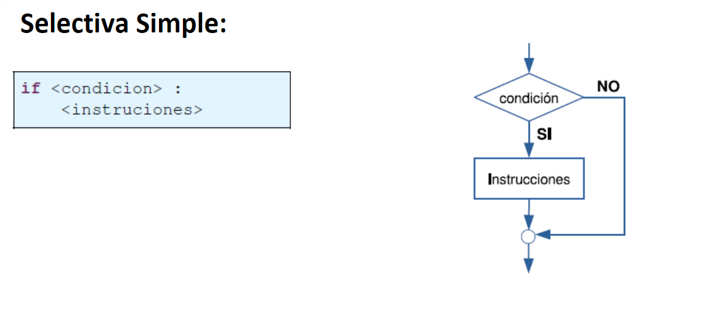
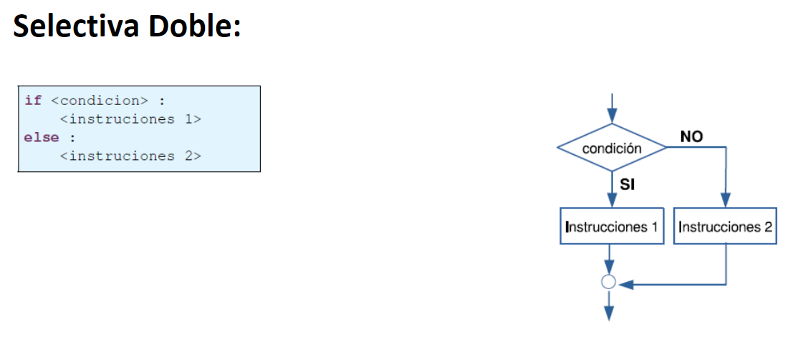
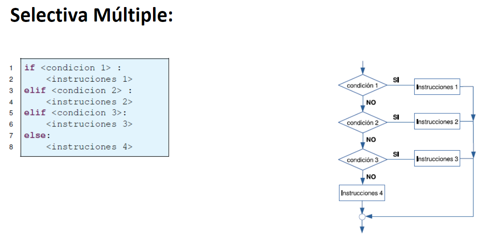
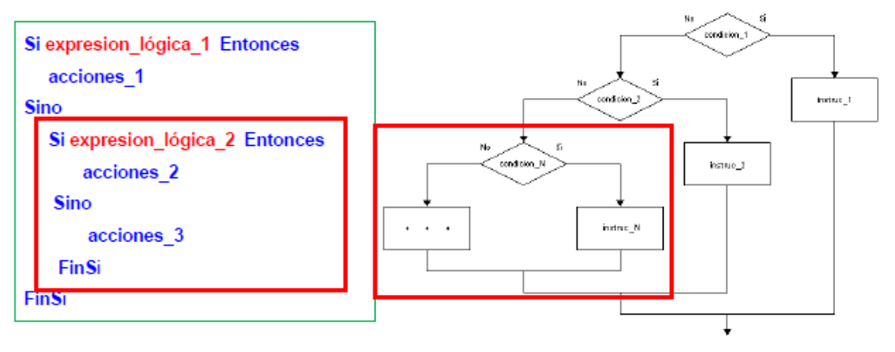
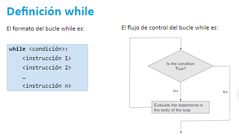
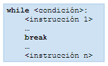
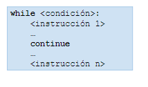

# Programming 1
## Estructuras de Control Selectiva
La estructura selectiva permite ejecutar instrucciones según un criterio o condición.

### Selectiva Simple - If

### Selectiva Doble - If/Else

### Selectiva Múltiple - If/Elif/Else

### Estructuras de Control Anidadas
Las estructuras de control selectivas pueden anidarse unas dentro de otras, cuando sea necesario tener más alternativas según la lógica del problema.

## Repetitive Control Structures
### While
La sentencia while es una Estructura de Control Repetitiva.
Al igua que una sentencia condicional if, la sentencia while utiliza una expresión condicional.
El bloque de instrucciones de while se ejecutará mientras la expresión condicional se evalúe como verdadera (True).

### Break
Hasta el momento hemos visto que todas las instrucciones del bucle while se ejecutan en cada iteración.
Python proporciona la palabra reservada break que termina un bucle por completo y salta a la siguiente instrucción que sigue al bucle.

### Continue
Hasta el momento hemos visto que todas las instrucciones del bucle while se ejecutan en cada iteración.
Python proporciona la palabra reservada continue que indica al bucle saltar a la evaluación de la condición nuevamente y continuar con el bucle.
