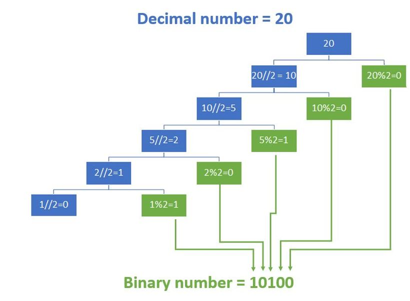

# Decimal a Binario
Su programa debe realizar la conversion del numero binario a partir de recibir un numero decimal del usuario.
Note que se puede utilizar las funciones modulo (%) y division entera (//), segun se muestra en la imagen.


Ademas, debe retornar la cantidad de digitos que tiene el numero binario.

```
Input Format
20

Constraints
En este ejercicio no se permite el uso de bibliotecas, ni funciones que realicen la conversion.

Output Format
El numero en binario es: 10100
La cantidad de digitson son: 5
```
```
Sample Input 0
20

Sample Output 0
El numero en binario es: 10100
La cantidad de digitos son: 5
```